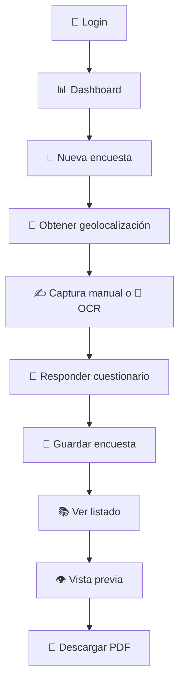

# 🗳️✨ FrontendCuestionario | Contigo QROO Encuestas Web ✨📋


## 🌟 Descripción General

**Contigo QROO Encuestas Web** es una plataforma frontend para levantamiento de encuestas ciudadanas en campo. Está diseñada para que personal operativo pueda **iniciar sesión 🔐**, **capturar datos manualmente ✍️ o mediante OCR 🪪**, **geolocalizar cada entrevista 📍**, **responder cuestionarios paginados 🧠**, **almacenar registros localmente 💾**, **consultar el historial 📚** y **exportar un PDF profesional 📄** con la información completa del levantamiento.

La interfaz está pensada para uso rápido en operación real, con navegación clara, componentes visuales modernos y una experiencia optimizada para escritorio y móvil 📱💻.

---

## 🎯 Objetivos del Sistema

- 🧾 Digitalizar encuestas de campo de forma estructurada.
- 🪪 Reducir captura manual gracias a OCR para credenciales.
- 📍 Asociar coordenadas GPS al momento del levantamiento.
- 🗂️ Centralizar datos de entrevistados, respuestas y trazabilidad.
- 📄 Generar evidencia en PDF lista para consulta o envío.
- ⚡ Ofrecer una experiencia fluida para brigadas, encuestadores y personal autorizado.

---

## 🚀 Funcionalidades Principales

### 🔐 Autenticación

- Inicio de sesión contra servicio real con JWT.
- Persistencia de sesión en `localStorage`.
- Rutas privadas protegidas.
- Cierre de sesión con confirmación.

### 🧭 Navegación principal

- Dashboard con resumen rápido del sistema.
- Menú lateral responsive.
- Modo expandido y colapsado en escritorio.
- Drawer móvil para operación en pantallas pequeñas.

### 🧍 Captura de persona

- Alta manual de datos personales.
- Captura por OCR desde imagen de credencial.
- Separación automática de nombres.
- Asignación de sección electoral.
- Asociación de municipio a partir del catálogo de secciones.

### 🪪 OCR de credencial

- Carga de imagen de INE.
- Escaneo mediante servicio OCR externo.
- Proceso de separación de nombre con servicio externo adicional.
- Fallback local si el servicio de separación falla.
- Overlay visual tipo escáner durante el procesamiento.

### 📍 Geolocalización y mapa

- Obtención de coordenadas desde el navegador.
- Visualización en mapa de solo lectura con Leaflet.
- Registro de latitud, longitud, precisión y fecha de captura.

### 🧠 Encuesta

- Flujo paginado para evitar pantallas demasiado largas.
- Cuestionario dividido por etapas temáticas.
- Captura de respuestas abiertas y cerradas.
- Reinicio controlado de entrevista.
- Confirmación antes de guardar.

### 📚 Gestión de registros

- Persistencia local de encuestas en `localStorage`.
- Listado paginado de encuestados.
- Vista previa elegante de cada registro.
- Exportación a PDF con formato visual.

### 📄 Exportación PDF

- PDF generado desde la vista previa.
- Respeta bloques visuales para evitar cortes bruscos de información.
- Muestra datos administrativos, datos personales, mapa y respuestas.
- Preparado para impresión o envío digital.

---

## 🖼️ Flujo General de Uso



---

## 🧱 Stack Tecnológico

### ⚙️ Base del proyecto

- ⚛️ React 19
- 🔷 TypeScript
- ⚡ Vite

### 🎨 UI / UX

- MUI
- Emotion
- React Toastify
- Material Icons

### 🧭 Navegación

- React Router DOM

### 📝 Formularios y validaciones

- React Hook Form
- Yup
- Hookform Resolvers

### 🌍 Mapa y geolocalización

- Leaflet
- React Leaflet
- Geolocation API del navegador

### 📷 OCR y captura visual

- React Webcam
- React Image Crop

### 📄 Exportación

- jsPDF
- html2canvas

### 🔌 Consumo HTTP

- Axios

### 🆔 Utilidades

- UUID
- Dayjs

---

## 🏗️ Arquitectura del Proyecto

```bash
src/
├── components/
│   ├── common/
│   ├── loading/
│   ├── map/
│   └── ui/
├── layouts/
├── pages/
│   ├── auth/
│   ├── dashboard/
│   ├── respondents/
│   └── surveys/
├── routes/
├── services/
├── store/
├── theme/
├── types/
└── utils/
```

### 📁 Descripción por carpeta

- `src/pages`:
  pantallas principales del sistema.
- `src/components`:
  componentes reutilizables como mapa, diálogos, overlays y loader.
- `src/services`:
  integración con APIs externas y backend.
- `src/store`:
  persistencia simple en `localStorage` para autenticación y encuestas.
- `src/utils`:
  helpers para geolocalización y generación de PDF.
- `src/routes`:
  definición de rutas públicas y privadas.
- `src/layouts`:
  estructura principal de navegación autenticada.
- `src/theme`:
  tokens y personalización visual.
- `src/types`:
  tipados del dominio.

---

## 🧭 Rutas de la Aplicación

| Ruta | Descripción | Acceso |
|------|-------------|--------|
| `/login` | Inicio de sesión | Público 🔓 |
| `/dashboard` | Panel principal | Privado 🔒 |
| `/surveys/new` | Captura de nueva encuesta | Privado 🔒 |
| `/respondents` | Listado de encuestados | Privado 🔒 |
| `/respondents/:id` | Vista previa de encuesta | Privado 🔒 |

---

## 🧠 Módulos Principales

### 1. 🔐 Login

Archivo principal: [`src/pages/auth/LoginPage.tsx`](/Users/ricardoorlandocastilloolivera/proyectHome/contigo-qroo-encuestas/src/pages/auth/LoginPage.tsx)

Este módulo permite autenticarse con usuario y contraseña usando el endpoint `POST /loginjwt`. Al iniciar sesión:

- ✅ se obtiene un token JWT,
- ✅ se guarda en `localStorage`,
- ✅ se registra la información del usuario,
- ✅ se habilita el acceso a las rutas privadas.

### 2. 📊 Dashboard

Archivo principal: [`src/pages/dashboard/DashboardPage.tsx`](/Users/ricardoorlandocastilloolivera/proyectHome/contigo-qroo-encuestas/src/pages/dashboard/DashboardPage.tsx)

Resume el estado operativo mostrando:

- total de encuestas guardadas,
- esquema de paginado,
- modalidad de captura disponible.

### 3. 📝 Nueva encuesta

Archivo principal: [`src/pages/surveys/SurveyNewPage.tsx`](/Users/ricardoorlandocastilloolivera/proyectHome/contigo-qroo-encuestas/src/pages/surveys/SurveyNewPage.tsx)

Es el corazón del sistema 💥. Aquí se realiza:

- captura de geolocalización,
- selección de modalidad manual u OCR,
- llenado de datos personales,
- consulta de catálogo de secciones,
- respuesta del cuestionario,
- guardado final de la entrevista.

La encuesta está dividida en estas etapas:

1. 🧩 Filtros e introducción
2. 👀 Reconocimiento
3. 📈 Desempeño
4. 🏘️ Problemáticas y cierre

### 4. 📚 Listado de encuestados

Archivo principal: [`src/pages/respondents/RespondentsListPage.tsx`](/Users/ricardoorlandocastilloolivera/proyectHome/contigo-qroo-encuestas/src/pages/respondents/RespondentsListPage.tsx)

Permite revisar los registros guardados con:

- paginado de 15 elementos por página,
- visualización resumida de datos,
- acceso a detalle individual.

### 5. 👁️ Vista previa y PDF

Archivo principal: [`src/pages/respondents/RespondentPreviewPage.tsx`](/Users/ricardoorlandocastilloolivera/proyectHome/contigo-qroo-encuestas/src/pages/respondents/RespondentPreviewPage.tsx)

Muestra un resumen visual del levantamiento:

- datos administrativos,
- datos de la persona,
- ubicación,
- respuestas agrupadas por sección,
- exportación a PDF.

### 6. 📄 Motor PDF

Archivo principal: [`src/utils/pdf.ts`](/Users/ricardoorlandocastilloolivera/proyectHome/contigo-qroo-encuestas/src/utils/pdf.ts)

Se encarga de:

- renderizar la vista previa,
- dividir el contenido en páginas,
- respetar bloques marcados con `data-pdf-block`,
- evitar cortes bruscos dentro de secciones y preguntas.

---

## 🔌 Integraciones Externas

### 🌐 Backend principal

Configurado en:
[`src/services/http.ts`](/Users/ricardoorlandocastilloolivera/proyectHome/contigo-qroo-encuestas/src/services/http.ts)

Base URL por defecto:

```bash
https://servdes1.proyectoqroo.com.mx/gsv/ibeta/api
```

### 🧾 Endpoints utilizados

| Método | Endpoint | Uso |
|--------|----------|-----|
| `POST` | `/loginjwt` | Autenticación 🔐 |
| `GET` | `/getSecciones` | Catálogo de secciones 🗂️ |

### 🪪 Servicios OCR externos

Usados en:
[`src/services/ocr.service.ts`](/Users/ricardoorlandocastilloolivera/proyectHome/contigo-qroo-encuestas/src/services/ocr.service.ts)

Servicios consumidos:

- `https://brmstudio.com.mx/ocr/ocr`
- `https://brmstudio.com.mx/ocr/separar-nombre`

---

## 🔐 Persistencia Local

El proyecto utiliza `localStorage` para almacenar información mientras se integran o consolidan flujos backend adicionales.

### Claves utilizadas

| Clave | Descripción |
|------|-------------|
| `contigo_qroo_token` | Token JWT del usuario |
| `contigo_qroo_user` | Datos del usuario autenticado |
| `contigo_qroo_respondents` | Encuestas guardadas localmente |

Archivos relacionados:

- [`src/store/auth.store.ts`](/Users/ricardoorlandocastilloolivera/proyectHome/contigo-qroo-encuestas/src/store/auth.store.ts)
- [`src/store/respondents.store.ts`](/Users/ricardoorlandocastilloolivera/proyectHome/contigo-qroo-encuestas/src/store/respondents.store.ts)

---

## ⚙️ Requisitos para Ejecutar

- 🟢 Node.js 20 o superior recomendado
- 📦 npm 10 o superior recomendado
- 🌐 Acceso a internet para servicios OCR y backend
- 📍 Permisos de geolocalización en el navegador

---

## 🛠️ Instalación Local

### 1. Clonar el repositorio 📥

```bash
git clone git@github.com:MiguelCortes1231/FrontendCuestionario.git
cd FrontendCuestionario
```

### 2. Instalar dependencias 📦

```bash
npm install
```

### 3. Configurar variables de entorno opcionales 🔧

Si deseas cambiar la URL base del backend, crea un archivo `.env`:

```bash
VITE_API_BASE_URL=https://tu-backend.com/api
```

> Si no defines `VITE_API_BASE_URL`, la app usa la URL por defecto configurada en el proyecto 🌍

### 4. Ejecutar en desarrollo ▶️

```bash
npm run dev
```

### 5. Generar build de producción 🏗️

```bash
npm run build
```

### 6. Previsualizar build localmente 👀

```bash
npm run preview
```

### 7. Ejecutar linter 🧹

```bash
npm run lint
```

---

## 🧪 Flujo de Prueba Recomendado

Para validar funcionalmente el sistema:

1. 🔐 Inicia sesión con un usuario válido.
2. 📍 Acepta permisos de ubicación.
3. 📝 Crea una encuesta nueva.
4. ✍️ Llena manualmente o carga una imagen para OCR.
5. 🧠 Responde todas las páginas del cuestionario.
6. 💾 Guarda el registro.
7. 📚 Ve al listado de encuestados.
8. 👁️ Abre la vista previa.
9. 📄 Descarga el PDF.

---

## 🎨 Experiencia Visual

El proyecto usa una identidad visual sobria e institucional, centrada en el color:

```bash
#6C3841
```

Elementos destacados:

- 🎯 tarjetas elevadas,
- 🌈 degradados suaves,
- 📱 diseño responsive,
- 🧭 navegación lateral clara,
- ✨ feedback visual con toasts, diálogos y loaders.

---

## 📍 Geolocalización

La app solicita ubicación usando la API del navegador y construye un objeto con:

- latitud,
- longitud,
- precisión,
- fecha/hora de captura.

Utilidad asociada:
[`src/utils/geolocation.ts`](/Users/ricardoorlandocastilloolivera/proyectHome/contigo-qroo-encuestas/src/utils/geolocation.ts)

Esto permite que cada entrevista quede vinculada a un punto geográfico real 🌎📌.

---

## 🪪 OCR y Procesamiento de Credenciales

El flujo OCR incluye:

- carga de imagen,
- envío al servicio OCR,
- recuperación de datos detectados,
- separación de nombres,
- normalización de sexo,
- derivación de fecha de nacimiento y género desde clave de elector cuando aplica,
- limpieza de colonia y campos de texto.

Si el servicio de separación falla, se aplica una estrategia local de respaldo para no bloquear la operación 🛟.

---

## 📄 Generación de PDF

El PDF exportado contiene:

- encabezado institucional,
- datos administrativos,
- datos de la persona entrevistada,
- mapa de ubicación,
- respuestas completas agrupadas por sección.

Además, el paginador está preparado para:

- respetar bloques visuales,
- mover secciones a la siguiente página si no caben,
- evitar cortes bruscos dentro de preguntas siempre que exista un bloque lógico marcado.

---

## 🔒 Seguridad y Consideraciones

- El token se almacena en `localStorage`.
- Las rutas privadas se validan con presencia de token.
- La persistencia de encuestas también es local actualmente.
- El sistema depende de conectividad para login, OCR y catálogo de secciones.

Para una versión productiva más robusta, sería recomendable agregar:

- refresh token 🔁
- expiración controlada de sesión ⏳
- backend de persistencia centralizada 🗄️
- manejo avanzado de errores de red 🚨
- suite de pruebas automatizadas 🧪

---

## 📌 Comandos Útiles

```bash
npm install
npm run dev
npm run build
npm run preview
npm run lint
```

---

## 🤝 Recomendaciones para Evolución

- ☁️ Conectar guardado/listado/detalle a backend real.
- 🧪 Añadir pruebas unitarias y de integración.
- 📊 Incorporar métricas operativas en dashboard.
- 🗃️ Sincronizar almacenamiento offline/online.
- 🔍 Mejorar validaciones de captura.
- 🖨️ Añadir más plantillas de exportación PDF.
- 🌐 Internacionalizar textos si el producto crece.

---

## 👨‍💻 Autor

**Ricardo Castillo Olivera** ✨👨‍💻

Desarrollo frontend, estructura funcional del sistema, experiencia de usuario, flujo operativo de captura, integración visual del módulo de encuestas, vista previa y exportación PDF.

---

## 🏁 Resumen Ejecutivo

Este proyecto entrega una base sólida para una **plataforma de encuestas en campo** con enfoque práctico y operativo 🚀

Incluye:

- 🔐 autenticación,
- 🪪 OCR,
- 📍 geolocalización,
- 📝 captura estructurada,
- 📚 consulta de registros,
- 📄 exportación a PDF.

Es una solución lista para seguir creciendo hacia un entorno de producción más robusto, manteniendo una experiencia moderna, clara y profesional ⭐⭐⭐⭐⭐
