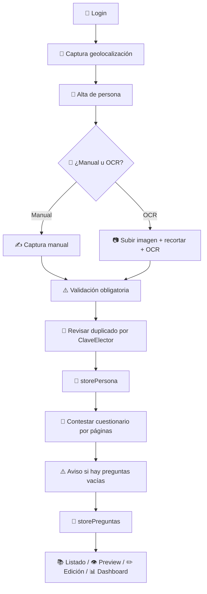
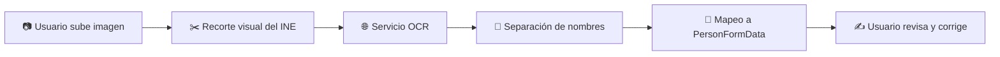
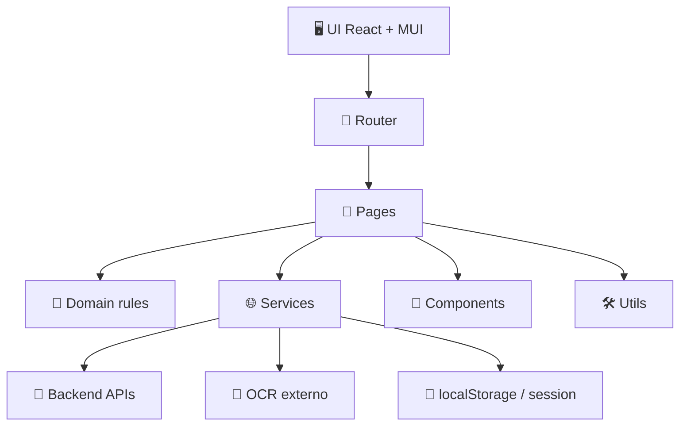
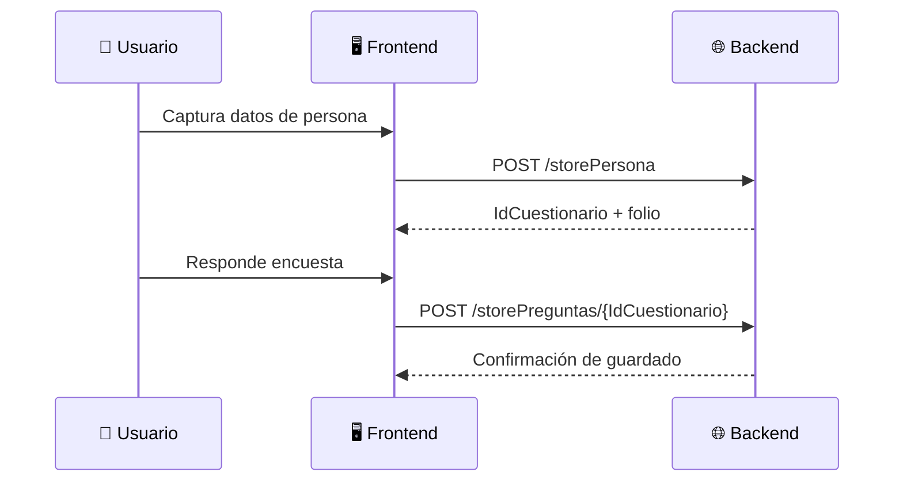
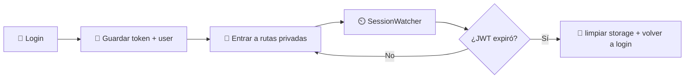

# 🗳️🌴 Contigo QROO Encuestas

> Plataforma web de levantamiento de encuestas ciudadanas en campo para Quintana Roo 📍🪪🧠📊  
> Documentación principal del proyecto, explicada con baby steps 👶✨, diagramas 🧭, reglas operativas ⚠️ y contexto técnico 🌐 para que cualquier persona pueda entenderla, usarla y moverla sin sufrir 🚀

---

## 🎉 TL;DR súper rápido

Si quieres entender el proyecto en 20 segundos ⏱️:

- 🔐 el usuario inicia sesión con JWT
- 🧍 da de alta a una persona manualmente o por OCR
- ⚠️ el frontend valida duplicados por clave de elector
- 📍 se captura geolocalización real del navegador
- 🧠 se responde el cuestionario por páginas
- 💾 la persona se guarda con `storePersona`
- 📝 las respuestas se guardan con `storePreguntas/{IdCuestionario}`
- 📚 el listado, preview, edición y dashboard ya usan APIs reales
- 📊 el dashboard muestra estadísticas reales del proyecto por municipio, secciones, fechas y geolocalización

En pocas palabras: **ya es un MVP funcional fuerte, conectado a backend real y pensado para operación de campo** 💪🌴

---

## 📚 Tabla de contenido

1. [✨ ¿Qué es este proyecto?](#-qué-es-este-proyecto)
2. [🎯 Objetivo del sistema](#-objetivo-del-sistema)
3. [🧠 Filosofía del MVP](#-filosofía-del-mvp)
4. [🧱 Stack tecnológico](#-stack-tecnológico)
5. [🗂️ Estructura de carpetas](#️-estructura-de-carpetas)
6. [🧭 Mapa general de la app](#-mapa-general-de-la-app)
7. [🌐 APIs reales integradas](#-apis-reales-integradas)
8. [🪜 Flujo completo del usuario](#-flujo-completo-del-usuario)
9. [🧍 Flujo de alta de persona](#-flujo-de-alta-de-persona)
10. [🪪 Flujo OCR](#-flujo-ocr)
11. [🧠 Flujo de cuestionario](#-flujo-de-cuestionario)
12. [📚 Listado, preview y edición](#-listado-preview-y-edición)
13. [📊 Dashboard](#-dashboard)
14. [⚠️ Reglas de negocio importantes](#️-reglas-de-negocio-importantes)
15. [💾 Persistencia local](#-persistencia-local)
16. [🚀 Cómo levantar el proyecto](#-cómo-levantar-el-proyecto)
17. [🧪 Scripts disponibles](#-scripts-disponibles)
18. [🛠️ Guía para desarrolladores](#️-guía-para-desarrolladores)
19. [🧩 Explicación archivo por archivo](#-explicación-archivo-por-archivo)
20. [🧭 Diagramas del sistema](#-diagramas-del-sistema)
21. [❓Preguntas frecuentes](#-preguntas-frecuentes)
22. [📘 Documentación extendida](#-documentación-extendida)

---

## ✨ ¿Qué es este proyecto?

**Contigo QROO Encuestas** es una aplicación frontend para brigadas, capturistas y operación territorial que necesitan levantar encuestas en campo de forma:

- rápida ⚡
- visual 🎨
- ordenada 🧩
- trazable 📍
- conectada con APIs reales 🌐

No es solamente un formulario.

Es una herramienta operativa para resolver un flujo completo:

1. 🔐 entrar con usuario
2. 🧍 capturar una persona
3. 🪪 apoyarse en OCR si hace falta
4. 📍 asociar la entrevista con una ubicación
5. 🧠 contestar el cuestionario
6. 💾 guardar datos en backend
7. 📚 consultar lo capturado
8. ✏️ corregir datos básicos
9. 👁️ revisar el levantamiento
10. 📄 exportar evidencia
11. 📊 analizar el avance del proyecto

---

## 🎯 Objetivo del sistema

### 🎯 Objetivo principal

Facilitar el levantamiento de encuestas ciudadanas en Quintana Roo con una herramienta digital profesional, usable en campo y con lectura estadística posterior 🌴📊

### 🎯 Objetivos secundarios

- reducir tiempo de captura 🕒
- reducir errores manuales 🛡️
- mejorar trazabilidad territorial 📍
- permitir consulta y corrección posterior 📚
- conectar la operación con un dashboard ejecutivo 📈

---

## 🧠 Filosofía del MVP

Este proyecto sigue una idea muy clara:

> “Primero hagamos que la operación funcione muy bien en la vida real; después refinamos capas de arquitectura y sofisticación” 🚀

Por eso el MVP prioriza:

- ✅ flujos funcionales reales
- ✅ integración con backend real
- ✅ validaciones útiles del lado frontend
- ✅ UX amigable para campo
- ✅ dashboard práctico

Y acepta conscientemente algunas decisiones:

- 🎛️ varias opciones de cuestionario viven en frontend
- ⚠️ algunas validaciones de negocio hoy están del lado cliente
- 🧩 algunos contratos se enriquecen o adaptan en frontend

Eso no es un error del proyecto.

Es una decisión pragmática de MVP bien orientado a operación 💪

---

## 🧱 Stack tecnológico

### Frontend principal ⚛️

- React 19 ⚛️
- TypeScript 🔷
- Vite ⚡

### UI / experiencia visual 🎨

- MUI
- Emotion
- React Toastify

### Navegación 🧭

- React Router DOM

### Integración backend 🌐

- Axios

### Mapa y territorio 🗺️

- Leaflet
- React Leaflet

### OCR / multimedia 🪪📷

- React Image Crop
- servicios OCR externos integrados vía HTTP

### PDF 📄

- html2canvas
- jsPDF

### Dependencias instaladas que también dejan espacio a evolución 🚀

El `package.json` incluye además paquetes como:

- `@mui/x-date-pickers` 📅
- `react-hook-form` 🧾
- `yup` ✅
- `qrcode.react` 🔳
- `react-webcam` 📷
- `rc-slider` 🎚️

Algunos ya se usan; otros pueden servir para evoluciones futuras del proyecto.

---

## 🗂️ Estructura de carpetas

```bash
src/
├── components/
│   ├── common/
│   ├── loading/
│   ├── map/
│   └── ui/
├── domain/
│   ├── person/
│   └── surveys/
├── layouts/
├── pages/
│   ├── auth/
│   ├── dashboard/
│   ├── respondents/
│   └── surveys/
├── routes/
├── services/
├── store/
├── theme/
├── types/
└── utils/
```

### Lectura rápida de cada carpeta 👶

- `components/` = piezas reutilizables visuales 🧩
- `domain/` = reglas compartidas del negocio 🧠
- `layouts/` = estructura general de la app 🏗️
- `pages/` = pantallas completas 📄
- `routes/` = mapa de navegación 🧭
- `services/` = comunicación con backend o servicios externos 🌐
- `store/` = persistencia local simple 💾
- `theme/` = identidad visual institucional 🎨
- `types/` = contratos TypeScript 🔷
- `utils/` = helpers generales 🛠️

---

## 🧭 Mapa general de la app

| Ruta | Pantalla | Propósito | Acceso |
|------|----------|-----------|--------|
| `/login` | Login | iniciar sesión 🔐 | público |
| `/dashboard` | Dashboard | ver métricas y panorama 📊 | privado |
| `/surveys/new` | Nueva encuesta | alta + encuesta + guardado 📝 | privado |
| `/respondents` | Listado | consultar registros 📚 | privado |
| `/respondents/:id` | Preview | revisar detalle 👁️ | privado |
| `/respondents/:id/edit` | Edición | corregir datos básicos ✏️ | privado |

---

## 🌐 APIs reales integradas

La app ya trabaja con backend real ✅

### 🔐 Autenticación

- `POST /loginjwt`

### 🧍 Alta y edición de persona / cuestionario

- `POST /storePersona`
- `GET /getCuestionarios`
- `GET /getCuestionario/{IdCuestionario}`
- `PUT /editCuestionario/{IdCuestionario}`
- `POST /storePreguntas/{IdCuestionario}`

### 🗂️ Catálogos

- `GET /getSecciones`

### 🧠 ¿Qué hace el frontend con estas APIs?

- adapta payloads 🧩
- convierte fechas 📅
- traduce catálogos de texto a enteros 🔁
- resuelve municipio por sección 🗺️
- detecta duplicados por clave de elector ⚠️

---

## 🪜 Flujo completo del usuario



---

## 🧍 Flujo de alta de persona

### Baby steps 👶

1. El usuario entra a `Realizar encuesta` 📝
2. La app intenta capturar geolocalización 📍
3. El usuario elige captura manual o OCR 🪪
4. Llena datos básicos de la persona 🧍
5. El frontend valida campos obligatorios 🚨
6. El frontend consulta `getCuestionarios` para detectar duplicado por `ClaveElector` ⚠️
7. Si todo va bien, llama a `storePersona` 🌐
8. Backend responde `IdCuestionario` y `folio` ✅
9. La app permite pasar a la encuesta 🧠

### Campos obligatorios actuales 🚨

- nombre
- primer apellido
- clave de elector
- sección
- dirección
- teléfono

### Reglas importantes 🧠

- el `folio` lo genera backend 🧾
- la fecha se normaliza a `YYYY-MM-DD` 📅
- si ya existe un registro con la misma clave de elector, la app muestra advertencia pero permite continuar si el usuario insiste ⚠️

---

## 🪪 Flujo OCR



### Qué resuelve el OCR 🤖

- nombres
- apellidos
- sexo
- fecha de nacimiento
- CURP
- clave de elector
- calle
- número
- colonia
- código postal
- sección
- vigencia
- tipo de credencial

### Qué hace el frontend además del OCR 🧠

- limpia espacios
- corrige formatos
- intenta derivar datos faltantes
- reconcilia sección con catálogo
- permite corrección manual antes de guardar

---

## 🧠 Flujo de cuestionario

La encuesta está dividida por páginas para hacer la captura más ligera y amigable 📄✨

### Páginas del cuestionario

1. `Filtros e introducción`
2. `Reconocimiento`
3. `Desempeño`
4. `Problemáticas y cierre`

### Regla importante del backend 🔁

El backend no recibe textos completos para las preguntas cerradas.

Recibe:

- `Pregunta1`
- `Pregunta2`
- ...
- `Pregunta13`

Y el frontend hace la traducción:

- opción visible 1 -> entero `1`
- opción visible 2 -> entero `2`
- opción visible 3 -> entero `3`

### Observaciones 📝

- puede ir vacía ✅
- se envía como `''` si no se captura nada

### Antes de guardar ⚠️

Si hay preguntas cerradas sin responder:

- la app muestra un modal de advertencia 🚨
- lista página y pregunta faltante 📋
- deja continuar y guardar ✅
- o regresar a la primera pendiente con foco automático 🎯

---

## 📚 Listado, preview y edición

### 📚 Listado

Usa `GET /getCuestionarios` y ya permite:

- búsqueda flexible 🔎
- filtro por municipio 🏙️
- filtro por sección 🗂️
- filtro por resultado ✅
- filtro por fecha 📅
- ordenamiento ↕️

### 👁️ Preview

Usa `GET /getCuestionario/{id}` y muestra:

- datos administrativos
- datos de la persona
- respuestas agrupadas
- mapa de ubicación
- botón de PDF

### ✏️ Edición

Usa `PUT /editCuestionario/{id}` y permite:

- corregir datos básicos
- mantener intactas las respuestas del cuestionario

---

## 📊 Dashboard

El dashboard ya consume datos reales 🧠📡

### Qué muestra hoy

- encuestas totales 🧮
- acumulado del año 📆
- municipios activos 🏙️
- secciones activas vs total catálogo 🗂️
- entrevistas completas ✅
- puntos geolocalizados 📍
- municipio líder 🥇
- tendencia mensual 📈
- acumulado por año 🧭
- ranking municipal de Quintana Roo 🏝️
- distribución por estatus 🎯
- top secciones más trabajadas 🔥
- mapa territorial 🛰️

### Importante 🌟

El **Ranking municipal de Quintana Roo** se conserva y se alimenta con los 11 municipios oficiales.

Además, la información de secciones no está hardcodeada:

- se toma del catálogo real de `getSecciones` ✅

---

## ⚠️ Reglas de negocio importantes

### 1. Duplicados por clave de elector

Backend todavía no bloquea duplicados por sí mismo, así que el frontend revisa `getCuestionarios`.

### 2. Folio

No se captura manualmente. Lo asigna backend después del alta.

### 3. Municipio

Se resuelve a partir de la sección electoral y su catálogo.

### 4. Nombre del encuestador

Si `IdUser` del cuestionario coincide con `contigo_qroo_user`, la UI muestra el nombre del usuario autenticado como encuestador 👤

### 5. Fecha de nacimiento

Si la captura llega como `dd/mm/yyyy`, se convierte a `yyyy-mm-dd` antes de enviar.

### 6. Preguntas cerradas

No son estrictamente obligatorias para permitir cierre del levantamiento, pero sí muestran advertencia si faltan.

---

## 💾 Persistencia local

La app usa `localStorage` para algunas piezas operativas:

### Claves principales

- `contigo_qroo_token` 🔐
- `contigo_qroo_user` 👤
- `contigo_qroo_respondents` 📚

### Nota importante 🧠

`contigo_qroo_respondents` hoy funciona más como vestigio o soporte del flujo viejo/local.  
La operación principal ya se está moviendo sobre APIs reales 🌐

---

## 🚀 Cómo levantar el proyecto

### 1. Instalar dependencias 📦

```bash
npm install
```

### 2. Levantar desarrollo 💻

```bash
npm run dev
```

### 3. Compilar producción 🏗️

```bash
npm run build
```

### 4. Previsualizar build 👀

```bash
npm run preview
```

---

## 🧪 Scripts disponibles

| Script | Qué hace | Cuándo usarlo |
|--------|----------|---------------|
| `npm run dev` | levanta el servidor local ⚡ | desarrollo diario |
| `npm run build` | compila TypeScript y genera build 🏗️ | validar antes de entregar |
| `npm run preview` | sirve la build local 👀 | revisar producción local |
| `npm run lint` | corre reglas estáticas 🧹 | control de calidad |

---

## 🛠️ Guía para desarrolladores

### Si eres nuevo en el proyecto 👶

Te recomiendo leer en este orden:

1. este `README.md` 📘
2. `docs/PROJECT_DOCUMENTATION.md` 📚
3. `src/services/respondents.service.ts` 🌐
4. `src/pages/surveys/SurveyNewPage.tsx` 📝
5. `src/pages/dashboard/DashboardPage.tsx` 📊
6. `src/routes/AppRouter.tsx` 🧭
7. `src/layouts/MainLayout.tsx` 🏗️

### Si quieres entender el dominio primero 🧠

Lee:

- `src/types/`
- `src/domain/`
- `src/services/respondents.service.ts`

### Si quieres entender solo UI 🎨

Lee:

- `src/pages/`
- `src/components/`
- `src/theme/`

### Si quieres entender integraciones 🌐

Lee:

- `src/services/http.ts`
- `src/services/auth.service.ts`
- `src/services/respondents.service.ts`
- `src/services/ocr.service.ts`
- `src/services/sections.service.ts`

---

## 🧩 Explicación archivo por archivo

### Núcleo de arranque 🚀

- `src/main.tsx`
  monta React, ThemeProvider, BrowserRouter y ToastContainer

- `src/App.tsx`
  renderiza router, overlay global y watcher de expiración de sesión

### Navegación y layout 🧭

- `src/routes/AppRouter.tsx`
  define rutas públicas y privadas

- `src/layouts/MainLayout.tsx`
  define la estructura interna autenticada

### Servicios 🌐

- `src/services/http.ts`
  configura Axios, token y loader global

- `src/services/auth.service.ts`
  login, logout y expiración de sesión

- `src/services/respondents.service.ts`
  cerebro de integración entre frontend y backend de cuestionarios

- `src/services/ocr.service.ts`
  integración OCR + normalización

- `src/services/sections.service.ts`
  catálogo de secciones y helpers de mapeo

### Dominio 🧠

- `src/domain/person/personForm.ts`
  validación obligatoria de datos de persona

- `src/domain/surveys/questionnaire.ts`
  metadata compartida del cuestionario y preguntas faltantes

### Pantallas principales 📄

- `src/pages/auth/LoginPage.tsx`
- `src/pages/surveys/SurveyNewPage.tsx`
- `src/pages/respondents/RespondentsListPage.tsx`
- `src/pages/respondents/RespondentPreviewPage.tsx`
- `src/pages/respondents/RespondentEditPage.tsx`
- `src/pages/dashboard/DashboardPage.tsx`

### Utilidades 🛠️

- `src/utils/geolocation.ts`
- `src/utils/contact.ts`
- `src/utils/maps.ts`
- `src/utils/pdf.ts`

---

## 🧭 Diagramas del sistema

### Arquitectura general



### Flujo del backend de persona + preguntas



### Flujo de sesión



---

## ❓Preguntas frecuentes

### “¿Por qué el dashboard usa catálogo real de secciones?” 🤔

Porque hardcodear todas las secciones sería frágil, difícil de mantener y desalineado con el backend real.

### “¿Por qué el frontend traduce las preguntas a enteros?” 🤔

Porque backend guarda respuestas cerradas como `Pregunta1..Pregunta13` numéricas y la UI necesita textos amigables.

### “¿El proyecto ya depende de APIs reales?” 🤔

Sí ✅, ya en varias piezas clave.

### “¿Se puede cerrar una encuesta con preguntas vacías?” 🤔

Sí ✅, pero con advertencia previa.

### “¿Observaciones puede ir vacía?” 🤔

Sí ✅

---

## 📘 Documentación extendida

Si quieres el manual más profundo y detallado, entra aquí 👇

[📚 Ver documentación extendida](./docs/PROJECT_DOCUMENTATION.md)

---

## 🙌 Autor

Desarrollado para operación territorial, captura de campo y análisis de encuestas por:

**Ricardo Orlando Castillo Olivera** ✨🚀🌴
