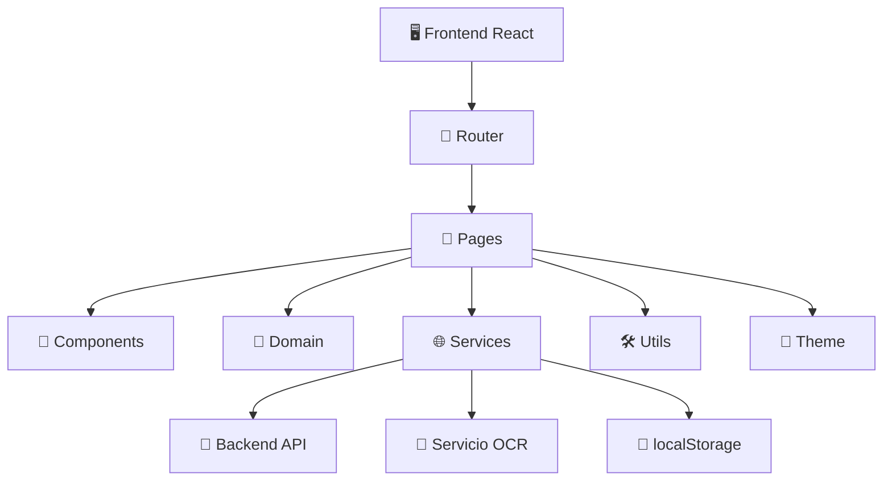
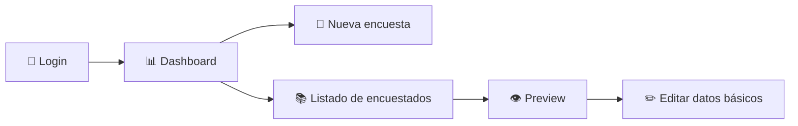
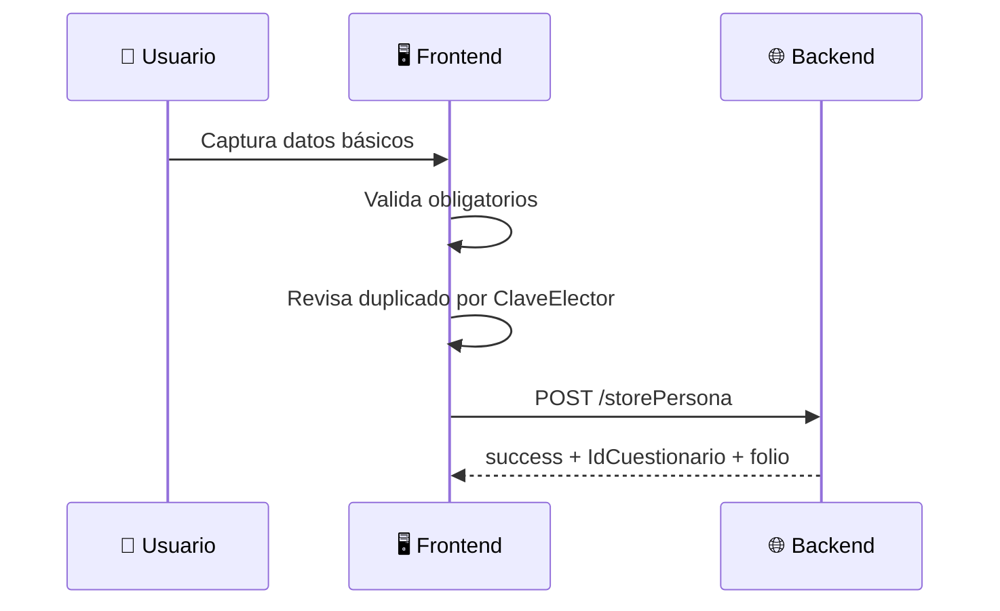

# 📚🧠 PROJECT_DOCUMENTATION

# 🌴 Contigo QROO Encuestas

> Manual maestro del proyecto: funcional, técnico, operativo, visual, explicativo y pensado para onboarding total 👶🚀✨  
> Si alguien llega mañana sin contexto, este documento debería ayudarle a entender qué existe, por qué existe, cómo fluye y cómo moverlo con seguridad 🛠️🌐

---

## 🗺️ Índice general

1. [🌟 Resumen ejecutivo](#-resumen-ejecutivo)
2. [🎯 Problema que resuelve](#-problema-que-resuelve)
3. [🧱 Arquitectura general](#-arquitectura-general)
4. [🧭 Navegación de usuario](#-navegación-de-usuario)
5. [🔐 Autenticación](#-autenticación)
6. [🧍 Alta de persona](#-alta-de-persona)
7. [🪪 OCR](#-ocr)
8. [🧠 Cuestionario y respuestas](#-cuestionario-y-respuestas)
9. [📚 Consulta de registros](#-consulta-de-registros)
10. [✏️ Edición de datos básicos](#️-edición-de-datos-básicos)
11. [👁️ Vista previa y PDF](#️-vista-previa-y-pdf)
12. [📊 Dashboard](#-dashboard)
13. [🌐 Servicios y contratos de API](#-servicios-y-contratos-de-api)
14. [🧠 Reglas de dominio](#-reglas-de-dominio)
15. [💾 Persistencia local y sesión](#-persistencia-local-y-sesión)
16. [🗂️ Estructura del código](#️-estructura-del-código)
17. [📄 Explicación archivo por archivo](#-explicación-archivo-por-archivo)
18. [🧪 Desarrollo, build y mantenimiento](#-desarrollo-build-y-mantenimiento)
19. [⚠️ Riesgos técnicos y próximos pasos](#️-riesgos-técnicos-y-próximos-pasos)

---

## 🌟 Resumen ejecutivo

Este proyecto es una aplicación frontend para levantamiento de encuestas ciudadanas en campo 📍

Su foco principal es:

- capturar personas 🧍
- responder un cuestionario 🧠
- guardar información en backend 🌐
- consultar y corregir registros 📚✏️
- visualizar estadísticas reales 📊

El sistema ya no es una maqueta.

Ya conversa con APIs reales y ya resuelve gran parte del ciclo operativo del levantamiento ✅

---

## 🎯 Problema que resuelve

Antes de una herramienta como esta, una operación de campo suele sufrir por:

- tiempo lento de captura 🐢
- errores manuales ❌
- duplicidad de registros ⚠️
- poca trazabilidad territorial 🗺️
- dificultad para revisar y corregir información 📚
- falta de lectura ejecutiva rápida 📉

**Contigo QROO Encuestas** busca corregir eso con un flujo digital unificado 💪

---

## 🧱 Arquitectura general



### Explicación muy simple 👶

- `Pages` = pantallas completas
- `Components` = piezas reutilizables
- `Domain` = reglas de negocio compartidas
- `Services` = comunicación con APIs
- `Utils` = helpers técnicos
- `Store` = persistencia local

---

## 🧭 Navegación de usuario



### Rutas principales

| Ruta | Rol |
|------|-----|
| `/login` | acceso inicial 🔐 |
| `/dashboard` | panel ejecutivo 📊 |
| `/surveys/new` | alta + encuesta 📝 |
| `/respondents` | listado 📚 |
| `/respondents/:id` | preview 👁️ |
| `/respondents/:id/edit` | edición ✏️ |

---

## 🔐 Autenticación

### ¿Cómo funciona? 👶

1. usuario captura credenciales
2. frontend manda `POST /loginjwt`
3. backend responde `token` + `user`
4. frontend guarda ambos en `localStorage`
5. se habilitan rutas privadas

### Archivos involucrados

- `src/pages/auth/LoginPage.tsx`
- `src/services/auth.service.ts`
- `src/services/http.ts`
- `src/store/auth.store.ts`
- `src/routes/AppRouter.tsx`
- `src/App.tsx`

### Detalles importantes 🧠

- `auth.store.ts` persiste token y usuario
- `http.ts` inserta `Authorization: Bearer ...`
- `SessionWatcher` en `App.tsx` agenda expiración exacta de sesión ⏲️
- si expira la sesión, la app limpia storage y redirige a login

---

## 🧍 Alta de persona

### Objetivo

Capturar la identidad y datos básicos del ciudadano antes del cuestionario.

### Flujo operativo



### Campos obligatorios actuales 🚨

- nombres
- apellido paterno
- clave de elector
- sección
- calle / dirección
- teléfono

### Decisiones importantes

- el folio no lo captura el usuario 🧾
- el backend lo genera al alta
- la fecha se normaliza antes de enviarse 📅
- el frontend advierte duplicados por `ClaveElector` ⚠️

### Archivos involucrados

- `src/pages/surveys/SurveyNewPage.tsx`
- `src/domain/person/personForm.ts`
- `src/services/respondents.service.ts`
- `src/services/sections.service.ts`

---

## 🪪 OCR

### Objetivo

Reducir tiempo de captura apoyándose en una fotografía del INE.

### Flujo

1. usuario sube imagen 📷
2. recorta credencial ✂️
3. se manda al OCR 🌐
4. se intenta separar nombres 🧠
5. frontend limpia y normaliza datos
6. usuario revisa y corrige

### Archivos involucrados

- `src/pages/surveys/SurveyNewPage.tsx`
- `src/services/ocr.service.ts`
- `src/components/ui/OcrScannerOverlay.tsx`

### Responsabilidades del OCR service

- ejecutar OCR remoto
- separar nombres y apellidos
- normalizar sexo
- intentar derivar fecha
- limpiar colonia, espacios y formatos

---

## 🧠 Cuestionario y respuestas

### Idea central

La UI trabaja con textos amigables; el backend trabaja con enteros `Pregunta1..Pregunta13`.

### Traducción ejemplo 🔁

Si el frontend muestra:

- `"Debe seguir recorriendo el estado y escuchando a la gente."`
- `"Debe enfocarse solo en el trabajo de oficina."`
- `"NS/NC"`

entonces backend recibe:

- `1`
- `2`
- `3`

### Reglas relevantes

- observaciones no es obligatoria 📝
- puede enviarse vacía
- las preguntas cerradas pueden quedar vacías
- antes de completar, la app muestra advertencia si faltan respuestas ⚠️
- el usuario puede continuar o regresar a la primera faltante 🎯

### Archivos involucrados

- `src/pages/surveys/SurveyNewPage.tsx`
- `src/domain/surveys/questionnaire.ts`
- `src/services/respondents.service.ts`
- `src/types/survey.ts`

---

## 📚 Consulta de registros

### Listado

La pantalla de listado usa `GET /getCuestionarios` y ya ofrece:

- búsqueda flexible 🔎
- filtros por municipio, sección, resultado y fecha 📅
- ordenamiento ↕️
- vista tabla / tarjetas 📱💻

### Preview

La vista previa usa `GET /getCuestionario/{id}` y muestra:

- datos administrativos
- datos de persona
- respuestas
- mapa
- exportación PDF

### Edición

La edición usa `PUT /editCuestionario/{id}` y permite cambiar datos básicos sin tocar respuestas.

---

## ✏️ Edición de datos básicos

### ¿Qué sí se puede editar?

- nombres
- apellidos
- teléfono
- sexo
- fecha de nacimiento
- CURP
- clave de elector
- dirección
- colonia
- CP
- municipio
- estado
- sección
- vigencia
- tipo de credencial

### ¿Qué no toca?

- respuestas del cuestionario ❌

### Archivos involucrados

- `src/pages/respondents/RespondentEditPage.tsx`
- `src/domain/person/personForm.ts`
- `src/services/respondents.service.ts`

---

## 👁️ Vista previa y PDF

### Vista previa

Organiza la encuesta en un formato claro para lectura humana.

### PDF

`exportNodeToPdf`:

- clona el DOM
- detecta bloques
- calcula cortes naturales
- renderiza por página
- descarga el PDF

### Archivos involucrados

- `src/pages/respondents/RespondentPreviewPage.tsx`
- `src/utils/pdf.ts`

---

## 📊 Dashboard

### Qué busca resolver

Dar lectura ejecutiva del avance real del proyecto sin abrir registro por registro 📊

### Qué muestra hoy

- encuestas totales
- año actual
- municipios activos
- secciones activas
- entrevistas completas
- puntos geolocalizados
- municipio líder
- tendencia mensual
- acumulado anual
- ranking municipal de Quintana Roo
- estatus de entrevistas
- top secciones
- mapa territorial

### Fuente real de datos

- cuestionarios remotos por `getCuestionarios`
- catálogo real de secciones por `getSecciones`

### Nota importante

El total de secciones **no** está hardcodeado.

Se toma del catálogo real ✅

---

## 🌐 Servicios y contratos de API

## `src/services/http.ts`

Responsabilidades:

- crear cliente Axios
- fijar `baseURL`
- insertar token
- activar/desactivar loader global
- expirar sesión en 401

## `src/services/respondents.service.ts`

Es el servicio más importante del dominio de cuestionarios.

Hace:

- alta de persona
- edición
- listado
- detalle
- guardado de respuestas
- detección de duplicados
- adaptación entre backend y frontend

## `src/services/sections.service.ts`

Hace:

- leer catálogo de secciones
- construir mapa sección → municipio

## `src/services/ocr.service.ts`

Hace:

- OCR
- separación de nombres
- heurísticas de limpieza
- normalización

---

## 🧠 Reglas de dominio

### Dominio persona

Archivo:

- `src/domain/person/personForm.ts`

Reglas:

- validación de obligatorios
- detección rápida de faltantes

### Dominio cuestionario

Archivo:

- `src/domain/surveys/questionnaire.ts`

Reglas:

- metadata de preguntas por página
- detección de preguntas vacías
- apoyo a navegación con foco

---

## 💾 Persistencia local y sesión

### Claves conocidas

- `contigo_qroo_token`
- `contigo_qroo_user`
- `contigo_qroo_respondents`

### Qué contienen

- token JWT
- usuario autenticado
- registros locales históricos / compatibilidad

### Nota operativa

La app ya depende mucho más de APIs reales que antes.  
La persistencia local sigue siendo útil como soporte o legado de ciertas partes del sistema.

---

## 🗂️ Estructura del código

### `src/components/`

Piezas UI reutilizables.

### `src/domain/`

Reglas compartidas del negocio.

### `src/layouts/`

Layout autenticado.

### `src/pages/`

Pantallas completas.

### `src/routes/`

Navegación.

### `src/services/`

Integraciones externas.

### `src/store/`

Persistencia local.

### `src/theme/`

Diseño institucional.

### `src/types/`

Contratos TypeScript.

### `src/utils/`

Helpers de soporte técnico.

---

## 📄 Explicación archivo por archivo

### Arranque 🚀

- `src/main.tsx`
  inicia React, tema, router y toasts

- `src/App.tsx`
  monta router, overlay global y watcher de sesión

### Navegación 🧭

- `src/routes/AppRouter.tsx`
  decide qué rutas son públicas o privadas

- `src/layouts/MainLayout.tsx`
  define drawer, appbar y zona principal autenticada

### Login 🔐

- `src/pages/auth/LoginPage.tsx`
  pantalla de login

- `src/services/auth.service.ts`
  login/logout/expireSession

- `src/store/auth.store.ts`
  acceso a token y usuario

### Encuesta 📝

- `src/pages/surveys/SurveyNewPage.tsx`
  flujo operativo más grande del sistema

- `src/domain/person/personForm.ts`
  validación obligatoria de persona

- `src/domain/surveys/questionnaire.ts`
  metadata de preguntas y faltantes

- `src/services/respondents.service.ts`
  integración con APIs reales del cuestionario

- `src/services/ocr.service.ts`
  OCR y limpieza

- `src/services/sections.service.ts`
  catálogo de secciones

### Respondents 📚

- `src/pages/respondents/RespondentsListPage.tsx`
- `src/pages/respondents/RespondentPreviewPage.tsx`
- `src/pages/respondents/RespondentEditPage.tsx`

### Dashboard 📊

- `src/pages/dashboard/DashboardPage.tsx`

### UI reusable 🧩

- `src/components/common/ConfirmDialog.tsx`
- `src/components/loading/GlobalLoadingOverlay.tsx`
- `src/components/map/ReadonlyGeoMap.tsx`
- `src/components/ui/OcrScannerOverlay.tsx`

### Utilidades 🛠️

- `src/utils/contact.ts`
- `src/utils/geolocation.ts`
- `src/utils/maps.ts`
- `src/utils/pdf.ts`

### Diseño 🎨

- `src/theme/tokens.ts`
- `src/theme/theme.ts`
- `src/index.css`
- `src/App.css`

### Configuración ⚙️

- `vite.config.ts`
- `eslint.config.js`
- `package.json`

---

## 🧪 Desarrollo, build y mantenimiento

### Scripts

```bash
npm run dev
npm run build
npm run preview
npm run lint
```

### Recomendación de rutina profesional 👨‍💻✨

1. hacer cambio
2. revisar tipado
3. correr build
4. revisar pantallas tocadas
5. validar APIs impactadas

### Qué revisar si algo falla ⚠️

- token vencido
- permisos de geolocalización
- disponibilidad del OCR
- conectividad con backend
- shape de respuestas del backend
- consistencia del catálogo de secciones

---

## ⚠️ Riesgos técnicos y próximos pasos

### Riesgos actuales

- parte del conocimiento del cuestionario aún vive del lado frontend 🎛️
- validación de duplicados aún no es nativa de backend ⚠️
- el archivo `SurveyNewPage.tsx` sigue siendo una pantalla grande 🧱
- el bundle final aún marca chunks grandes en build 📦

### Próximos pasos naturales

- partir `SurveyNewPage.tsx` en subcomponentes o hooks
- mover más reglas del negocio a `domain/`
- agregar filtros globales más fuertes al dashboard
- robustecer validaciones también del lado backend
- mejorar code splitting

---

## 💚 Cierre

Este proyecto ya tiene una base seria, útil y bastante profesional para operación real 🚀🌴

Lo importante no es solo que “se vea bonito”, sino que:

- funciona ✅
- ya consume APIs reales ✅
- ya tiene trazabilidad ✅
- ya tiene lectura estadística ✅
- ya tiene varias decisiones correctas de dominio y arquitectura ✅

Si alguien nuevo entra al proyecto, debería poder usar este documento como mapa principal de onboarding 🧭📚✨
